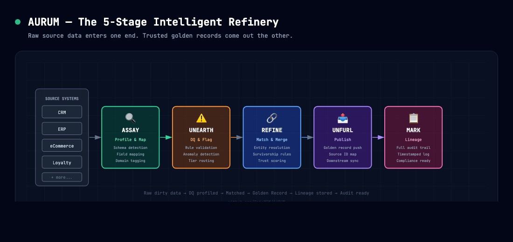
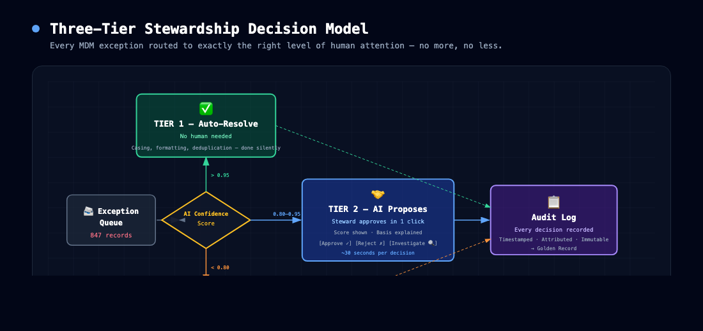
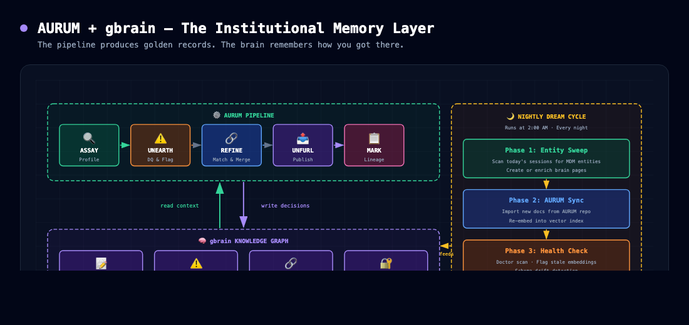
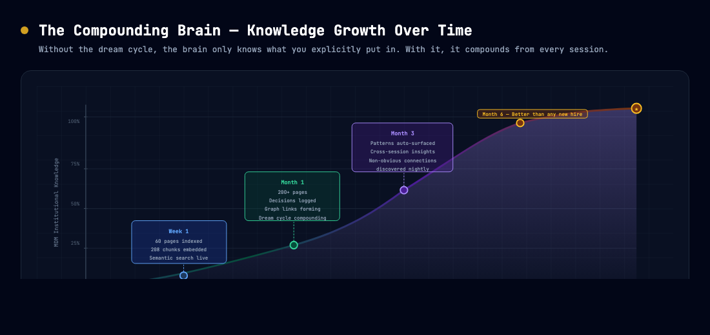

# AURUM Diagrams

Visual reference for the AURUM MDM pipeline, decision model, gbrain memory layer, and dream cycle.
All Mermaid diagrams render natively on GitHub. PNG previews included for quick scanning.

---

## Quick Visual Reference

### Pipeline


### Stewardship Decision Model


### gbrain Memory Layer


### Knowledge Compounding


---

## Interactive Mermaid Diagrams

7|
     8|## 1. The AURUM Pipeline — 5-Stage Intelligent Refinery
     9|
    10|```mermaid
    11|flowchart LR
    12|    subgraph SRC["📥 Source Systems"]
    13|        direction TB
    14|        CRM[CRM]
    15|        ERP[ERP]
    16|        ECOMM[eCommerce]
    17|        LOY[Loyalty]
    18|    end
    19|
    20|    subgraph PIPE["⚙️ AURUM Pipeline"]
    21|        direction LR
    22|        A["🔍 ASSAY\nProfile & Map"]
    23|        B["⚠️ UNEARTH\nDQ & Flag"]
    24|        C["🔗 REFINE\nMatch & Merge"]
    25|        D["📤 UNFURL\nPublish"]
    26|        E["📋 MARK\nLineage"]
    27|    end
    28|
    29|    subgraph OUT["✨ Output"]
    30|        direction TB
    31|        GR[("Golden\nRecord Store")]
    32|        LIN[(Lineage\nStore)]
    33|    end
    34|
    35|    SRC --> A
    36|    A --> B
    37|    B --> C
    38|    C --> D
    39|    D --> E
    40|    D --> GR
    41|    E --> LIN
    42|
    43|    style A fill:#064e3b,stroke:#34d399,color:#fff
    44|    style B fill:#7c2d12,stroke:#fb923c,color:#fff
    45|    style C fill:#1e3a5f,stroke:#60a5fa,color:#fff
    46|    style D fill:#4a1d96,stroke:#a78bfa,color:#fff
    47|    style E fill:#831843,stroke:#f472b6,color:#fff
    48|    style GR fill:#1e1b4b,stroke:#818cf8,color:#fff
    49|    style LIN fill:#1e1b4b,stroke:#818cf8,color:#fff
    50|```
    51|
    52|