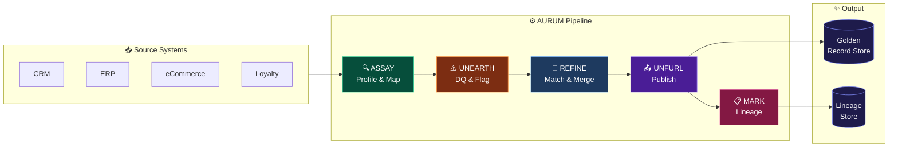
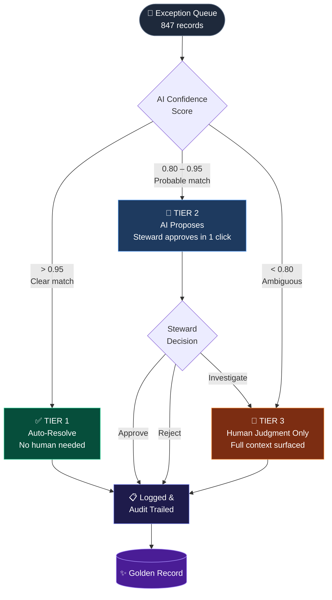
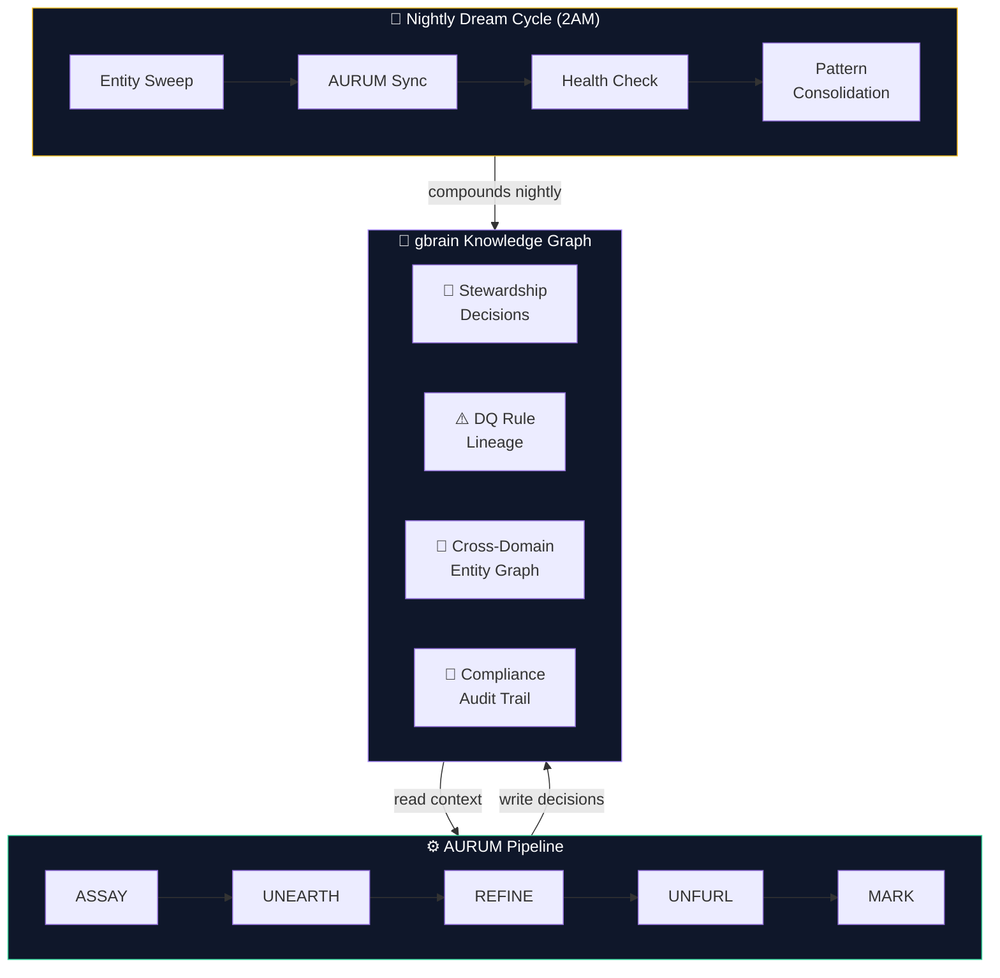
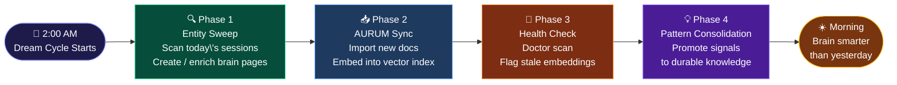
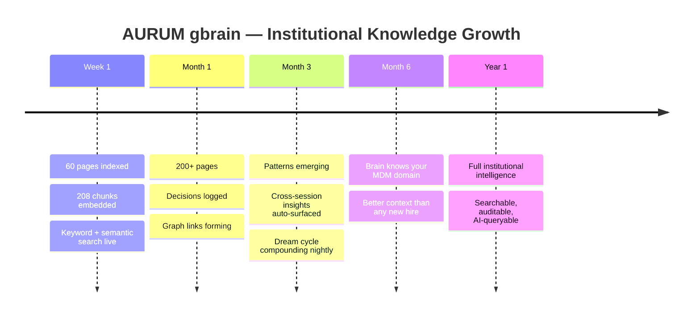

# AURUM Diagrams

Visual reference for the AURUM MDM pipeline, decision model, gbrain memory layer, and dream cycle.  
All diagrams render natively on GitHub.

---

## 1. The AURUM Pipeline — 5-Stage Intelligent Refinery

---

## 2. Three-Tier Stewardship Decision Model

---

## 3. AURUM + gbrain — The Memory Layer

---

## 4. The Nightly Dream Cycle — 4 Phases

---

## 5. The Compounding Brain — Knowledge Growth Over Time

---

*AURUM v0.2.0 — github.com/RajaMDM/AURUM*
