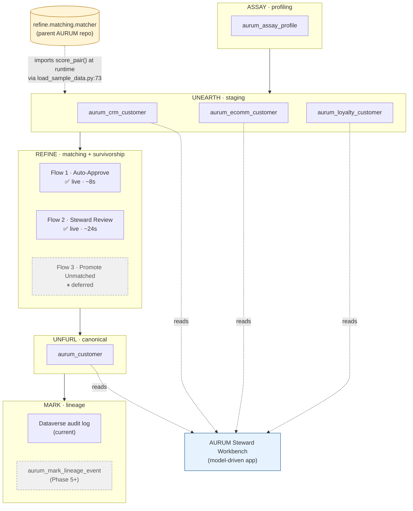

# AURUM-PP — Architecture Diagram

A visual companion to `AURUM_PP_TECHNICAL_LAYOUT.md` §2. Shows the five AURUM stages (ASSAY → UNEARTH → REFINE → UNFURL → MARK) as a left-to-right horizontal flow, with the Power Platform component(s) that implement each stage grouped underneath. Solid arrows show data flowing between stages; dotted arrows show read-only consumption by the AURUM Steward Workbench model-driven app and the runtime import dependency on the parent AURUM Python repo.

The diagram makes two claims visible. First, that AURUM-PP follows the AURUM 5-stage architecture as a literal data flow, not just a vocabulary borrow — each stage produces an artifact the next stage consumes. Second, that the matcher dependency on the parent AURUM repo crosses an implementation boundary at runtime: `scripts/load_sample_data.py` imports `score_pair()` from `refine.matching.matcher` and feeds the resulting composite scores into the staging tables that the REFINE flows trigger on. Removing the parent-repo dependency would break score generation; nothing else in the diagram would change.

**Legend.** Solid edges = data flow between stages. Dotted edges = read-only consumption (model-driven app) or runtime import (parent AURUM matcher). Dashed-border boxes = deferred / not-yet-built components (Flow 3, custom MARK lineage table). Yellow-tinted box = external dependency outside the Power Platform layer. Blue-tinted box = consumer that does not produce stage-level data.

**Notes for the reader.**

- The REFINE stage shows three flows because Phase 4 spec'd three; only Flow 1 and Flow 2 are live as of the diagram's snapshot. Flow 3 is dashed because it's deferred to Day 4.
- MARK shows two boxes because the current implementation leans on Dataverse's built-in audit log; a custom `aurum_mark_lineage_event` table is documented in `ROADMAP.md` as Phase 5+ work.
- The `AURUM` external box is not part of AURUM-PP — it lives in the parent repo at `refine/matching/matcher.py`. The dotted import arrow lands on the UNEARTH subgraph because that's where the matcher's output is materialized: into the `aurum_match_confidence` column on the staging records.
- The model-driven app reads from staging tables AND the canonical table. The "Pending Steward Review" views read staging; the canonical-record forms read `aurum_customer` directly. The app does not write to either via this read path; writes happen via the REFINE flows (and, future, Flow 3 when steward triggers a promotion).
